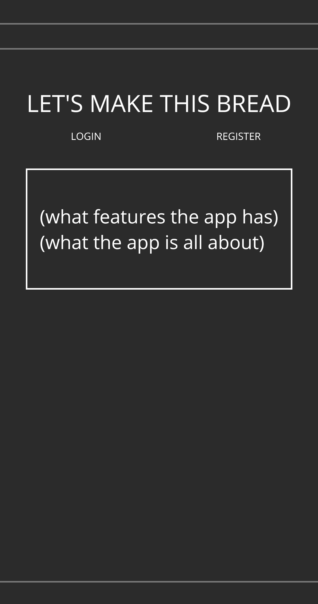
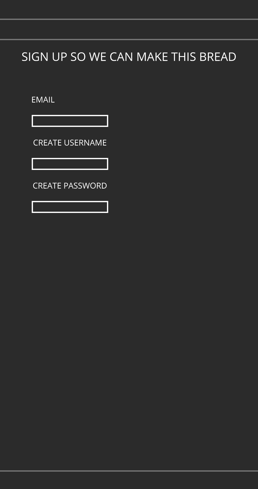
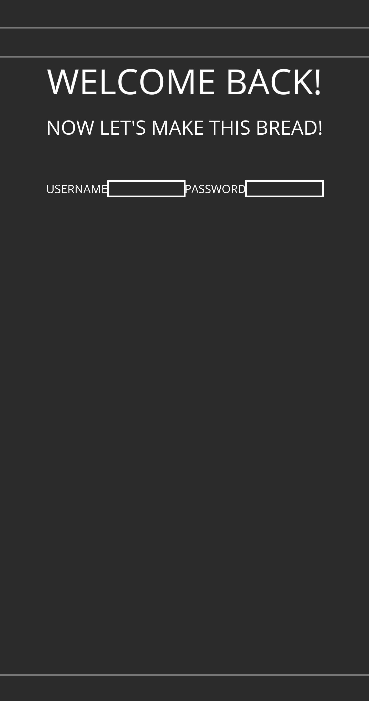
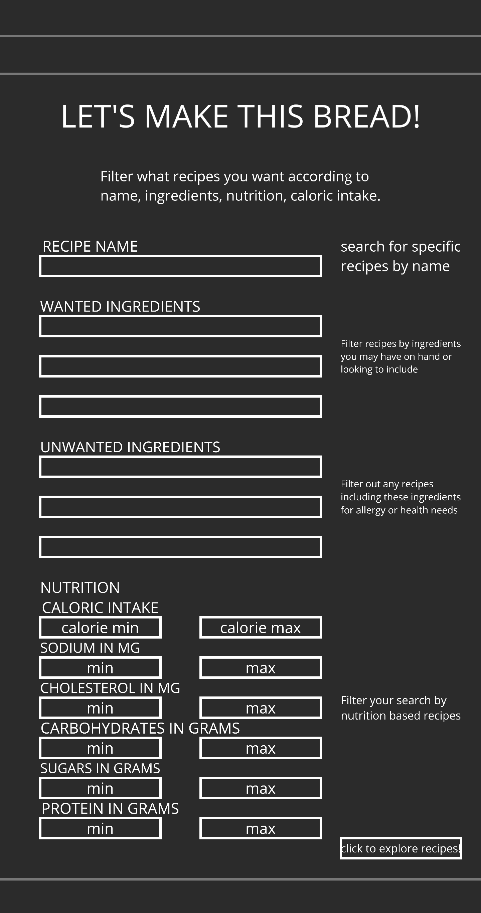
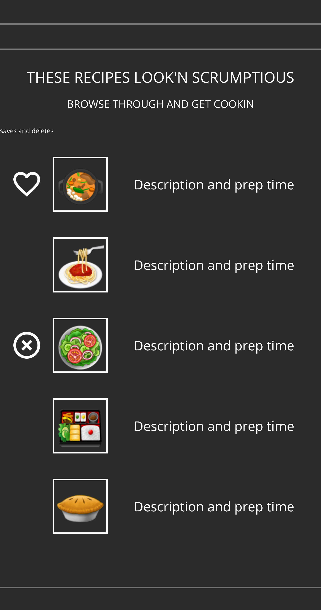
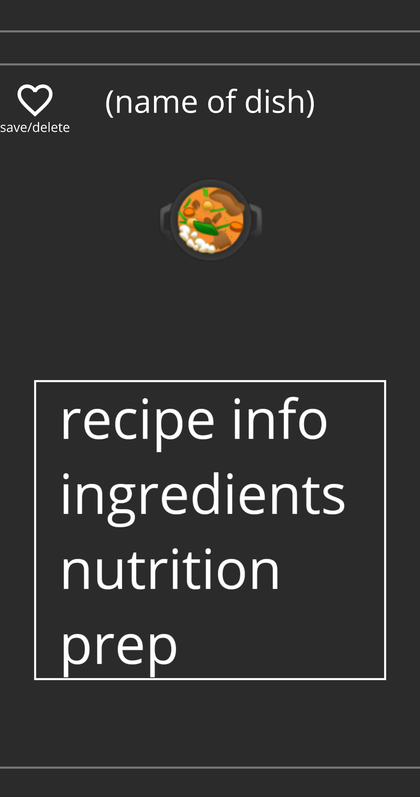
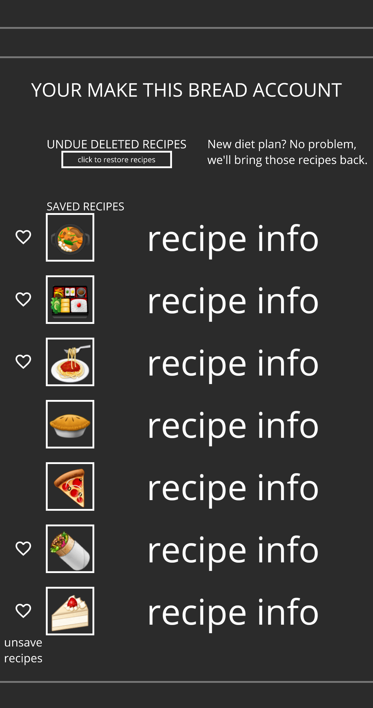

# README

# Recipes
## Description
This app will be a simple way to find delicious meals that fit your lifestyle. After registering and logging in, you can search and filter through recipes to your liking. If there are deitary restrictions, ingredients you want to incorporate or leave out, or just have something at home you want to use, you can search and find that recipe. If there is a recipe you particularly like, you can save them to your account. If there is something you don't like, just delete it to browse through easier.
## Wireframe

 

# Ruby version 2.6.3

# System dependencies
knock, bcrypt, react, foreman 

# Database creation
rails db:create

# Database initialization
rails db:migrate

# Deploy locally 
run foreman start -F Procfile.dev
It will run on localhost:3000 by default

# Github
https://github.com/mrtravisscott/recipes

# User stories
1. search for recipes
2. look at recipe and nutrition
3. save recipes to your recipe list with optional note
4. got to my recipe list
5. edit recipe notes 
6. delete recipe from list
7. login to make account 

